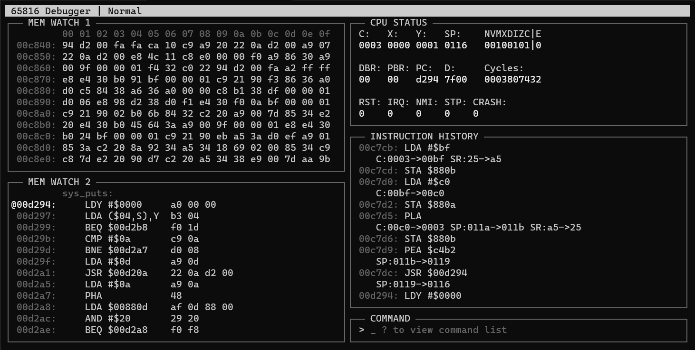

# 816CE: A 65816 Emulator/Debugging Assistant and 65816 CPU Core

This project aims to provide two usable pieces of software/code to aid in the software development for systems based on the 65816 CPU. The first component is the 65816 core, which provides a simple API for stepping the 65816 core through its operation. The other component is a user interface built around this API which runs in the terminal.



## Files

Everything is written in C and should be compatible with any C compiler which supports C99 or newer. The 65816 core makes use of very few libraries (all from the C standard library headers) and should be portable to any platform that supports `uint32_t` sized variables. On the other hand, the simulator interface requires ncurses and sockets to operate.

* Any file in the `src` directory which starts with `65816` is part of the CPU core.
* Any other files in the `src` directory are used for the simulation interface. `debugger.c` contains the `main()` function for the simulator.

## COMPILING

To build on a standard GNU/Linux system, make sure that `libncurses` is installed. Then run `make` in the repo's root directory. This should produce a binary in the `build` directory which can be run.

## USAGE

The simulator program can be invoked with or without arguments. The help menu is below:

```
65816 Simulator (C) Ray Clemens 2022-2023
USAGE:
 $ 816ce (--cpu filename) (--mem (offset) filename)

Args:
 --cpu filename ............ Preload the CPU with a saved state
 --mem (offset) filename ... Load memory at offset (in hex) with a file
```

These arguments can be overridden during program execution by running the `load` command to load memory or CPU save states. Note that multiple memory files can be passed to be loaded in different memory regions based on the offset provided, which defaults to address 0. Multiple CPU save files can also be loaded, however, only the last file provided will be loaded.

While the simulator is open, press `?` to access the command help menu.

```
Available commands
 > exit
 > mw[1|2] [mem|asm] (pc|addr)
 > mw[1|2] aaaaaa
 > irq [set|clear]
 > nmi [set|clear]
 > aaaaaa: xx yy zz
 > save [mem|cpu] filename
 > load mem (offset) filename
 > load cpu filename
 > cpu [reg] xxxx
 > bp aaaaaa
 ? ... Help Menu
 ^C to clear command input
```

Some explanation:

* `[cat|dog]` - either `cat` or `dog` can be entered but the field is required
* `(value)` - an optional field
* `aaaaaa` - an address in hex
* `reg` - a CPU register in all caps (e.g. PC)

Additionally, the function keys are of use:

```
F2  - Toggle IRQ on CPU
F3  - Toggle NMI on CPU
F4  - Halt CPU
F5  - Run until Halt pressed, CPU CRASH, CPU executes STP, or a breakpoint is hit
F6  - Step over instruction at current PC
F7  - Step by one instruction
F9  - Reset CPU
F12 - Pressing F12 twice will exit the simulator without saving.
```

### File loading & saving

* Files can be specified to be loaded into memory and/or the CPU via arguments to the simulator or during runtime by using the `load` command.
* Loaded files are not automatically saved upon termination of the simulator.
* Memory contents and CPU state can be manually saved through the use of the `save` command

## TIPS

* When using a memory watch in disassembly mode, the disassembly of immediate operand widths is based on the current state of the CPU's register widths. This means that the assembly output may be incorrect because a 2-byte instruction might be seen as a 3-byte instruction (such as `lda #$10`) if M is 0. A way to avoid this behavior is by running the disassembly mode in 'pc follow mode' by running the command `mw[1|2] asm pc`.

